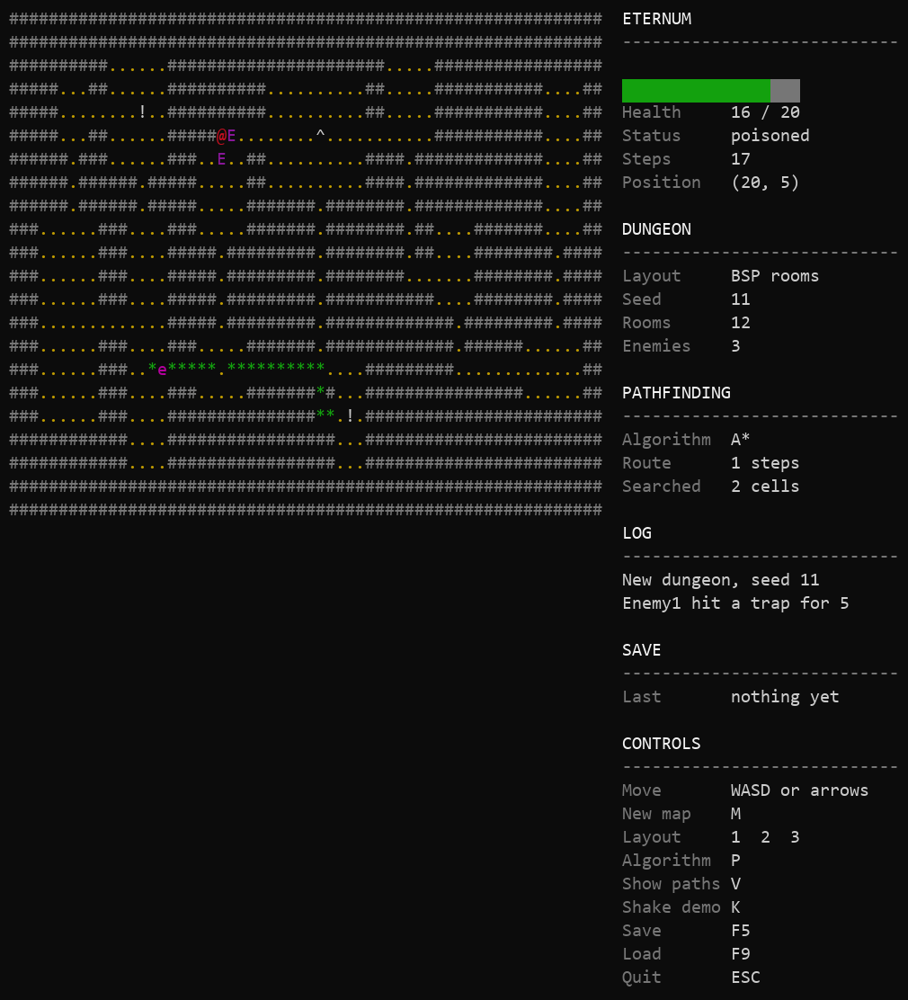
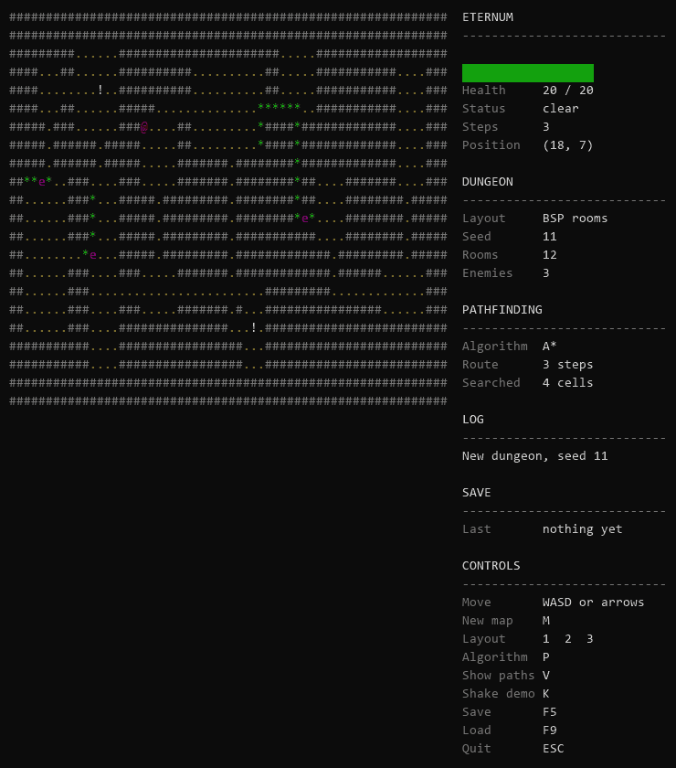
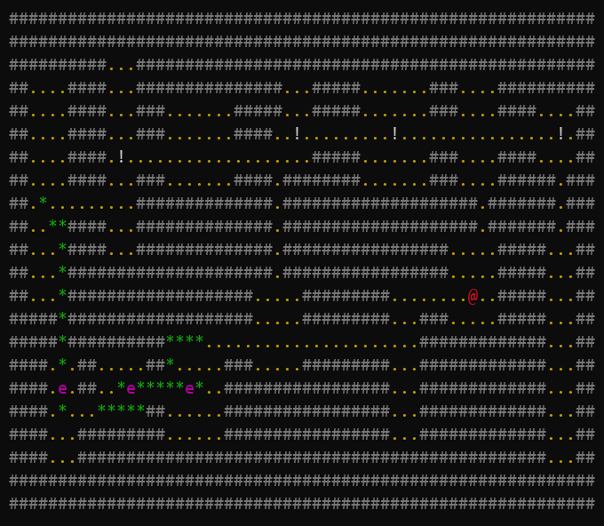
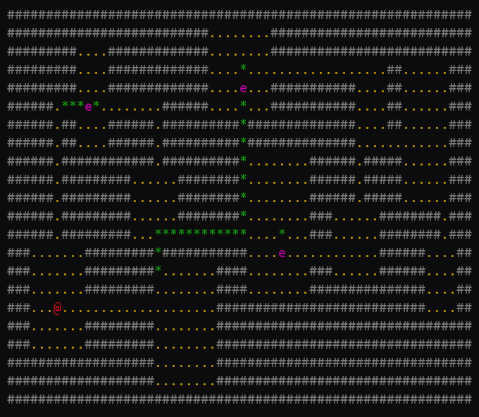
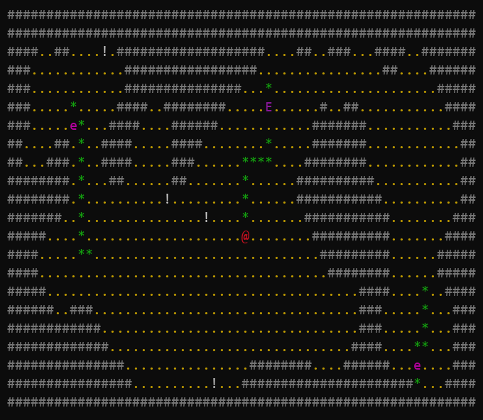

# Eternum Engine

A roguelike engine written from scratch in C++20. It runs in a terminal, builds its own
dungeons, and the things in it work out where you are and come after you.

[](https://github.com/Singularity-Works/Project-Eternum-Engine/actions/workflows/ci.yml)
[](https://github.com/Singularity-Works/Project-Eternum-Engine/actions/workflows/ci-windows.yml)



## It actually runs



The green trail is the route an enemy worked out to reach me. It is not decoration, it is the
actual path the search returned, drawn a step at a time as it walks it.

Real time, not turn based. Everything moves on its own clock whether you touch the keyboard or
not.

## Why it exists

I wanted somewhere to write data structures and algorithms properly instead of reading about
them. A roguelike is a good excuse for that. It needs graph search, procedural generation, an
entity system, serialization and a renderer, and you can watch all of it working.

Everything here is written from scratch. The only dependencies are GoogleTest for the tests and
nlohmann/json for saving. No game engine, no graphics library, no curses.

About 11,000 lines of engine and 4,800 lines of tests.

## Dungeon generation

Three algorithms, switched at runtime with `1`, `2` and `3`.

**BSP.** Cuts the map in half over and over until the pieces are small enough, then drops one
room into each piece. Rooms cannot overlap because each one owns its own slice of the map.



**Scattered rooms.** Throws rooms at the map at random and keeps the ones that do not land on
top of anything. Looser and less even than BSP, which is the point of having both.



**Cave.** Cellular automata. Fill the map with noise, then repeatedly turn every cell into
whatever most of its neighbours are. Anything left stranded afterwards gets walled off so the
result is always one connected space.



Rooms are joined by a minimum spanning tree over their centres, so every room is reachable with
the least corridor, plus a couple of extra corridors on top so the map has loops instead of
being a dead end tree.

Every dungeon is tested for connectivity across 40 seeds per algorithm. Not "usually
connected". Every one.

The same seed rebuilds the same dungeon, the same spawn point and the same enemy behaviour:

```bash
eternum-engine --seed 42 --gen bsp
```

## Pathfinding

Breadth first, Dijkstra and A*, switched at runtime with `P`. Press `V` to draw the routes.

Every search reports how many cells it opened, which is the honest way to compare them. Same
map, same start, same goal, same answer:

| Algorithm | Cells opened |
| --- | --- |
| Dijkstra | 1064 |
| A* | 278 |

A* is Dijkstra with a guess at the distance still to go. Both go through one function in the
code, because that is literally the only difference between them.

They are supposed to disagree when the ground costs different amounts to cross, and they do. On
a grid where the direct line is passable but expensive:

| Algorithm | Route | Cost |
| --- | --- | --- |
| Breadth first | 4 steps | 151 |
| Dijkstra | 6 steps | 6 |

Breadth first only counts steps, so it walks straight through the expensive cells. Dijkstra
goes the long way round for almost nothing.

## Enemies

Three states, driven by a line of sight check.

- **Roaming.** No idea where you are. Picks a reachable cell nearby and walks to it.
- **Hunting.** Can see you right now. Routes straight at you and moves faster.
- **Searching.** Lost sight of you. Walks to where you *were* before giving up.

That last one is the bit worth watching. Duck round a corner and they commit to your last known
position rather than magically knowing you moved.

Lowercase `e` means it has not seen you. Capital `E` means it has.

## Combat

Health, Attacker and StatusEffects are three separate components rather than one. An entity with
Health and no Attacker is a barrel. One with an Attacker and no Health is a trap. One with both
is a fighter.

Walking into something is how you hit it. There is no attack key.

Taking a hit opens a short window where further damage is ignored, because without it standing
between two enemies kills you faster than you can read the screen. Poison deliberately ignores
that window, or it would never land during a fight.

Effects are poison, stun and slow. Your hits stagger what you hit. Enemy bites sometimes poison
you.

## Traps and loot

Traps sit disguised as floor until something walks onto them, then show as `^`. They do not care
who stepped on them, so the enemies hunting you walk into the same traps you do.

Pickups are `!` and heal whoever crosses them. If you are already at full health they stay on
the floor rather than being wasted.

Both announce themselves through the event system, which is what the log beside the map is built
from. The HUD knows nothing about traps or loot, it just writes down what it is told.

## Saving

`F5` saves, `F9` loads. One snapshot gets written twice, as readable JSON and as MessagePack:

```
eternum-save.json      7294 bytes
eternum-save.msgpack   3243 bytes
```

Same data, and the binary is about 44% of the size. Loading prefers the binary.

The map is stored cell by cell rather than as a seed to regenerate from. Storing the seed would
be smaller, but then changing a generator would silently invalidate every old save.

A save from a different format version is refused rather than half applied.

## How it is put together

Component based, closer to Unity than to a data oriented ECS.

- **Entity** owns components and children. Components reach their systems when the entity enters
  the scene, not when they are added.
- **ComponentSystem&lt;T&gt;** holds every component of one type and drives its update.
- **Systems** are registered once and driven by the runtime loop: entity, input, pathfinding,
  grid, dungeon, event, HUD, save.

A component joins its system through a CRTP base:

```cpp
class Transform final : public ComponentOf< Transform >
```

That one line supplies the type tag, the clone and the system registration. The hooks are pure
virtual, so forgetting is a compile error rather than a component that silently never registers.

## The renderer

Worth calling out because it took the most care.

The first version cleared the screen and wrote each cell separately, which is about 2,600 stream
writes per frame. It flickered badly.

Now the whole frame is built into one string and written in a single call, colour codes are only
emitted when the colour actually changes, and after the first frame only the cells that differ
get repainted. A full frame went from roughly 8,100 bytes to 3,000. A step costs a handful of
bytes instead of a repaint.

It takes its own alternate screen buffer, so quitting leaves your terminal scrollback untouched.

There is trauma based camera shake on top. Things add trauma, it decays on its own, and the
offset comes from whatever trauma happens to be right now, so two hits close together stack into
one bigger jolt instead of the second restarting the first.

## Tests

287 tests, run on Linux and Windows in CI.

```bash
cmake -B build
cmake --build build --config Release
ctest --test-dir build
```

The ones worth looking at are the property tests rather than the getter checks:

- Every generator produces one connected space across 40 seeds
- The same seed rebuilds a byte identical dungeon
- A* opens fewer cells than Dijkstra and returns the same route
- Saving and loading a whole game returns you somewhere indistinguishable
- The same three seconds at 30fps and at 120fps produce the same number of steps

## Building

Needs CMake 3.16+ and a compiler with C++20. GoogleTest and nlohmann/json are both vendored, so
there is nothing to fetch.

```bash
git clone https://github.com/Singularity-Works/Project-Eternum-Engine.git
cd Project-Eternum-Engine
cmake -B build
cmake --build build --config Release
```

Then run it:

```bash
./build/Release/eternum-engine
```

| Flag | What it does |
| --- | --- |
| `--seed <number>` | Build the first dungeon from a known seed |
| `--gen <name>` | `bsp`, `rooms` or `cave` |
| `--shake` | Start with the camera shake held on, to look at it |
| `--verbose` | Say what the engine is doing while it starts, off by default |
| `--help` | Print the flags and exit |

### Controls

| Key | Action |
| --- | --- |
| WASD or arrows | Move, hold to walk |
| M | New dungeon |
| 1 2 3 | Switch generator |
| P | Switch pathfinding algorithm |
| V | Show or hide enemy routes |
| K | Hold the camera shake on |
| F5 / F9 | Save / load |
| ESC | Quit |

## What it is not

Being straight about this, because a README that only lists wins is not worth much.

- **It is not a game.** There is no goal, no progression and no reason to keep playing. It is an
  engine with enough gameplay on top to prove the engine works.
- **The terminal needs to be reasonably wide.** The side panel needs about 97 columns. Below
  that it drops underneath the map instead, which works but looks worse.
- **Held key input is only properly solved on Windows.** Windows reads real console key events,
  so a held key is held. Elsewhere it falls back to treating a key as held for a moment after the
  last event, because a plain terminal has no key up to read.
- **Input is not testable.** The player controller talks to the input system directly, so the
  "hold a key and walk" path is only verified by playing it. That needs an injectable interface
  and has not had one yet.
- **Spawning lives in the wrong place.** The dungeon system places the player, the enemies and
  the props, because it is the thing that knows where the open cells are. It belongs in a game
  layer that does not exist yet.

## License

MIT. See [LICENSE](LICENSE).
